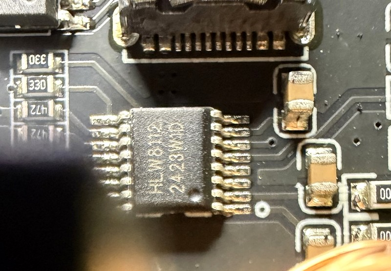

# Panda PWR Hardware Analysis

> Reverse-engineered from BIGTREETECH's stock firmware images and the recovery
> tool published at https://github.com/bigtreetech/PandaPWR. No schematic exists
> publicly. The outputs and the button have since been confirmed on a running
> unit (docs/BENCH_NOTES.md), and a destructive teardown on 2026-09-27
> identified the main components by their markings
> ([Physical teardown](#physical-teardown-2026-09-27)). No trace has been
> followed with a meter yet, so every pin-to-part connection below is still
> firmware evidence, not continuity.

Reproduce every claim below with:

```bash
python analysis/find_pins.py analysis/stock/panda_pwr-v1.0.0.1.bin
```

Images analysed (all four decode identically where they overlap):

| File | Project | IDF | Built |
|---|---|---|---|
| `panda_pwr-v1.0.0.bin` | `espnow_example` | v5.1.1 | 2024-10-15 |
| `panda_pwr-v1.0.0.1.bin` | `panda_pwr` | v5.1.1 | 2025-01-13 |
| `panda_pwr-v1.0.1_beta1.bin` | `panda_pwr` | v5.1.1 | 2025-01-13 |
| `panda_pwr_01.00.02.05.bin` | `panda_pwr` | v5.3.3 | (stripped) |

`v1.0.0.1` is the primary subject: it is the newest non-beta build of the
classic (non-MQTT-broker) firmware and retains the most `__FUNCTION__` strings.

## Module

| | |
|---|---|
| Module | ESP8684-MINI-1-H4 — **ESP32-C2**, RISC-V, 272 KB SRAM |
| Chip ID | `0x000C` in the image header |
| Flash | 4 MB, DIO. Factory log reports `c8 4016` = GD25Q32 |
| Console | UART0, which is GPIO20 (TX) / GPIO19 (RX) on the C2 |
| Programming | USB Type-C through a USB-UART bridge; the factory tool uses `before=default_reset`, so auto-reset into download mode works |

Image segments (from `esp_image.py`):

| Seg | Load addr | Length | Region |
|---|---|---|---|
| 0 | `0x3c090020` | `0x24928` | DROM (flash rodata) |
| 1 | `0x3fcacf30` | `0x232c` | DRAM |
| 2 | `0x40380000` | `0x9394` | IRAM |
| 3 | `0x42000020` | `0x8e5d0` | IROM (flash code) |
| 4 | `0x40389394` | `0x3b90` | IRAM |

`gp` (`__global_pointer$`) resolves to `0x3fcad730`, from the `auipc gp` /
`addi gp` pair at `0x40380438`. Several board constants are addressed
gp-relative, so this is needed to read them.

## Physical teardown (2026-09-27)

One Panda PWR Rev 1 was opened destructively and inspected directly. The unit
opened destructively for this teardown is the purchased spare. The original
Panda PWR remains intact and is retained for bench and firmware testing;
continuity measurements from here on belong to the spare. Photographs
by Daniel Brown; the four below are crops/enhancements of those photographs, not
generated images. FCC internal photos were used for comparison but are not
reproduced here.

> **Mains hazard.** An opened unit has lost the enclosure's touch protection.
> Treat any energised measurement on it as potentially lethal. Do the
> continuity mapping below unpowered first.

<a href="images/hardware/panda-pwr-board-overview.jpg"></a>

*Overall Panda PWR Rev 1 PCB after enclosure opening.*

<a href="images/hardware/panda-pwr-board-angle.jpg"></a>

*Angled view: HLK-20M05, relay, sensing magnetics, USB ports and the controller
end.*

<a href="images/hardware/panda-pwr-sensing-section.jpg"></a>

*Mains protection and sensing section.*

<a href="images/hardware/panda-pwr-hlw8112-metering-ic.jpg"></a>

*HLW8112 package marking and the surrounding analog network.*

### Identified by marking

These markings are legible. A marking establishes what the part is, not what it
is wired to.

| Part | Marking | Role |
|---|---|---|
| Controller | ESP8684-MINI-1-H4 (also in BTT's published specs) | Matches the chip ID and flash analysed below. The module marking is not legible in the four crops |
| Metering IC | `HLW8112`, second line `2423W1D` (lot/date code, not decoded) | Energy meter. Checked against the datasheet in [Energy meter](#energy-meter) |
| Voltage sensing | `ZMPT107-1` | Isolated current-type voltage transformer (2 mA : 2 mA, 1000:1000, 3000 V AC isolation per the [Zeming spec](https://5nrorwxhmqqijik.leadongcdn.com/ZMPT107-1+specification-aidiqBqoKomRilSqqnnkikq.pdf)) |
| Auxiliary supply | Hi-Link `HLK-20M05`: 100–240 VAC 0.4 A 50–60 Hz in, 5 VDC 4 A 20 W out | Isolated mains-to-5 V supply |
| Mains relay | Songle `SRD-05VDC-SL-B`, 10 A 250 VAC / 10 A 30 VDC | The relay GPIO7 drives (per firmware and bench clicks; the coil driver is not traced) |
| Fuse | Black radial body, `T2A 250V`, Jdtfuse | A fuse. **What it protects is not known.** There is also a separate glass cartridge fuse in clips whose rating is not legible |

Also present: the RGB status LED (next to `RGB` silkscreen), two USB-A ports,
the USB-C programming/service port, the `RESET`-labelled button, and a pad row
silkscreened roughly `GND RX TX 3V3` at the controller end. That pad row looks
like a UART header from the silkscreen alone; it has not been checked.

### Inferred, not confirmed

| Part | Observation | Working identity |
|---|---|---|
| Yellow EI-core transformer | Beside the ZMPT107-1, no readable marking | Probably the current-sense transformer. Unconfirmed until it is traced into the HLW8112 |
| Green toroid, two windings | Near the relay | Probably a common-mode choke / EMI filter |
| Blue disc | Beside the fuse, marking not read | Possibly a MOV or other surge suppressor |
| Yellow rectangular capacitor | Beside the blue disc, marking not read | Probably a mains EMI film capacitor. Not called X1/X2: the marking has not been read |
| `AP65N06NF` | Photographed, but not in the committed crops | A 60 V N-channel MOSFET if the package matches. Its role is not traced; it cannot be the mains switch |

### FCC model difference

FCC ID `2BAS6-PANDAPWR` (grantee Shenzhen BIQU Innovation Technology Co., Ltd.)
carries a "Model Difference" letter dated 2024-07-17. According to search-index
excerpts of a mirrored copy
([manuals.plus](https://manuals.plus/m/d2ffb86b9c70f673e9e77e69a77a697aba42d3293698eece14e3dcbeb16183a3)),
it says the Panda PWR, Panda PWR Lite and Panda PWR Pro are "the same circuit
and RF module, except appearance color and model name". The FCC site and every
mirror refused automated access, so this wording has not been read from the
primary document.

Taken at face value, that is a declared circuit and RF-module identity among
those three models. It does not say the PCB layout is identical, and it does not
cover `2BAS6-PANDAPWRV2`, a separate FCC ID.

## Stock partition table

Recovered from `Recovery_tool.rar` (`PandaPWR_2024_08_20_partition.bin`), not
inferred:

| Partition | Type | Offset | Size |
|---|---|---|---|
| `nvs` | data/nvs | `0x009000` | 20 K |
| `otadata` | data/ota | `0x00e000` | 8 K |
| `app0` | app/ota_0 | `0x010000` | 1280 K |
| `app1` | app/ota_1 | `0x150000` | 1280 K |
| `spiffs` | data/spiffs | `0x290000` | 1472 K |

The recovery archive also carries the stock bootloader
(`PandaPWR_2024_08_20_bootloader.bin`, flashed at `0x0`) and the factory
`flash_download_tool` config, which confirms `chip=esp32c2`, DIO, and the
`0x0 / 0x8000 / 0x10000` layout.

## What is linked — and what that rules out

The set of ESP-IDF components present in the image is a hard upper bound on what
the hardware can be. Only two peripheral drivers appear:

- `driver/gpio`
- `driver/spi` (`gpspi` master, `spi_bus_lock`, plus `esp_hw_support/dma`)

**Not** linked: LEDC, RMT, I2C, ADC oneshot, pulse counter. The ESP32-C2 has no
RMT or I2S peripheral at all, so an addressable LED cannot be driven the usual
way — and indeed the status LED turns out to run over SPI + DMA.

The UART driver *is* used (see below) even though `uart_*` functions leave no
`__FUNCTION__` strings in this build; absence of a name string means "not
identifiable by name", not "not linked". `find_pins.py` locates `uart_set_pin`
structurally instead.

Application code occupies roughly `0x42004000`–`0x4200d000`; everything above
`0x42010000` is IDF. Task entry points created by `app_main` (`0x4200412c`):

| Task | Entry |
|---|---|
| (unnamed) | `0x42004458` |
| `app_ctl_task` | `0x420073e4` |
| `wifi_state` | `0x42004bb6` |
| `ele_task` | `0x42007b46` |

## Pin map

### Confirmed from the binary

| GPIO | Function | Evidence |
|---|---|---|
| **2** | Energy meter UART1 **TX** | `uart_set_pin(UART1, 2, 3, -1, -1)` at `0x4200b3cc` |
| **3** | Energy meter UART1 **RX** | same call |
| **4** | Status LED data (WS2812-style, SPI2 MOSI) | `spi_bus_config_t` at `0x4200b77c` takes `mosi` from the config object's first byte; that object is memcpy'd at `0x420072c6` from the immediate `0x00c0f004`, whose low byte is `0x04` |
| **7** | **Mains relay — ACTIVE LOW** | `gpio_config` INPUT_OUTPUT at `0x4200724c`; the `/update_ele_data` JSON builder computes `power_state` as `snez(gpio_get_level(7) - 1)` at `0x42005cbc`, i.e. reported ON when the pin reads **0**; the control task drives `gpio_set_level(7, desired ^ 1)` at `0x4200762e` |
| **18** | **USB1 switch — active high** | `gpio_config` INPUT_OUTPUT at `0x4200725c`; `usb_state` is `seqz(gpio_get_level(18) - 1)` at `0x42005cd8`, i.e. reported ON when the pin reads **1** |
| **6** | External toggle input | `gpio_config` INPUT, no pull, at `0x42007270`. In `app_ctl_task` (`0x420075f8`–`0x42007636`) its level is compared against the previous value cached at `gp - 0x7d4`; on **any** change the desired-power bit is inverted and written to GPIO7 |

> **GPIO7 idles HIGH for relay-off.** Anything that drives it low energises the
> relay. Bring-up code must set it high before configuring it as an output, and
> the first bench test must be done with the mains side disconnected.

GPIO6 having no pull-up means it is externally driven, and "invert the target on
every transition" is how you service a **maintained-contact** switch (a rocker or
latching button) rather than a momentary one.

But that reading is weaker than it first looks: BTT's user manual documents
exactly one control, the Bind button, and no published product photo shows a
second one. So the *handling* is edge-triggered-toggle for certain; what is
physically on the other end of GPIO6 is genuinely unknown.

The `power_state` / `usb_state` polarity pair is worth restating because it is
easy to get backwards: the same JSON builder reads both pins eight bytes apart
(`0x42005bf4` for GPIO7, `0x42005bfc` for GPIO18) and then applies **opposite**
tests to them — `snez` for power, `seqz` for USB.

### High confidence, one inference step

| GPIO | Function | Evidence |
|---|---|---|
| **10** | Push button — `INPUT`, internal pull-up | `gpio_config` at `0x42007434` builds its mask as `1ULL << *(uint8_t *)(gp - 0x544)`; that byte is `0x0a`. Mode `INPUT`, `pull_up_en = 1` |

The descriptor at `gp - 0x544` (`0x3fcad1ec`) reads
`0a 00 00 00 | 0a 00 00 00 | 05 00 00 00 | 64 00 00 00`. Only the first byte is
proven to be the pin; the rest is unread.

### How GPIO7 / GPIO18 / GPIO6 were pinned down

`fn 0x42007232`, called directly from `app_main`, is the only place these three
are configured. All three are configured with no pull and no interrupt; GPIO7
and GPIO18 as `INPUT_OUTPUT` rather than `OUTPUT`, which is consistent with
firmware that reads back the level it drove — and is why the state JSON can be
built entirely from `gpio_get_level`.

The gpio.c leaves are not named in rodata. `gpio_set_level` (`0x420145bc`) was
found as the call immediately after `gpio_config` inside the output-configure
helper `0x4200b510`, and both were then confirmed from their bodies:
`0x420145bc` writes the `W1TS` / `W1TC` registers at `+0x8` / `+0xc` and takes a
level in `a1`; `0x420145ec` reads the `IN` register at `+0x3c` and takes only a
pin. `find_pins.py` rediscovers them positionally and tells them apart by arity.

`fn 0x42005748` is the HTTP handler block — it holds the `/update_ele_data` JSON
fragments, the captive-portal redirect, and the firmware-version string — so the
`gpio_get_level` results it formats are definitionally the pins behind the
public API's `power_state` and `usb_state`.

### Reserved by the C2 / module

| GPIO | Note |
|---|---|
| 8, 9 | Strapping pins; GPIO9 selects boot mode |
| 12–17 | SPI flash on the ESP8684-MINI-1 |
| 19, 20 | UART0 console (RX / TX) |

## Energy meter

The chip is an **HLW8112** (Hiliwei), identified by its package marking at the
teardown. The protocol the stock firmware speaks matches the HLW8112 datasheet
point for point (reconciled below).

A register-based metering IC on **UART1, 9600 baud, 8E1** (`uart_param_config`
at `0x4200b3bc`: `baud=0x2580`, `data_bits=3`, `parity=2`, `stop_bits=1`;
`uart_driver_install` with 256-byte RX and TX buffers).

Wire format, built in `0x4200ab14`:

```
[0xA5] [reg | 0x80 for writes] [data ...] [~(sum of all previous bytes)]
```

Register `0xEA` is exempt from the `| 0x80` write flag and acts as the
write-enable gate: `0xE5` unlocks register writes, `0xDC` re-locks them, and
`0x5A` / `0xA5` select a mode. The four initialization/status registers read
here are 16-bit. HLW8112 metrology-register widths vary, so the exact registers
and widths used by `ele_task` still need to be recovered before implementing
`dp_meter`.

The init sequence (`0x4200acf4` onward) reads registers `0x01`, `0x40`, `0x13`,
`0x1D`, then writes:

| Register | Value |
|---|---|
| `0x00` | `0x0A04` |
| `0x01` | `0x0181` |
| `0x13` | `0x046D` |
| `0x1D` | `0x3219` |
| `0x40` | `0x4680` |

`ele_task` (`0x42007b46`) polls the device roughly every 100 ms through a vtable
installed at `0x4200b3fa` (`+0x4` open, `+0x8` flush, `+0xc` write, `+0x10`
read, `+0x14` no-op) and populates six values — matching the six fields the
stock HTTP API returns (voltage, current, power, energy, frequency, plus a
status word).

### Reconciliation with the HLW8112 datasheet

Source: [HLW8110/HLW8112 DataSheet REV 1.01](https://datasheet.lcsc.com/datasheet/pdf/7618fcc29341bc35e74ce1d001211dc8.pdf?productCode=C970140)
(Hiliwei, hiliwi.com), §9 and §12.2, cross-checked against the Chinese user
manual [REV 1.19](https://atta.szlcsc.com/upload/public/pdf/source/20201210/C970139_FFA461AC8E4AB6B608E7D4DCF6BFBFF4.pdf) §12.2.

| Stock firmware (binary) | HLW8112 datasheet | Match |
|---|---|---|
| UART1 at 9600 baud | UART mode (`SPIEN` low) at 9600 when `SCLK`=1, `SCSN`=0; 19200 and 38400 are the other straps | Yes |
| 8E1 | 11-bit frame: start, 8 data bits LSB first, **even** parity, stop (§12.2.2; "even" is explicit in the Chinese manual) | Yes |
| `0xA5` header | Every frame starts `0xA5` | Yes |
| `reg \| 0x80` for writes | Command bit 7 = 1 is a write, 0 a read; bits 6:0 are the address | Yes |
| `~(sum of all previous bytes)` | Check byte = bitwise NOT of the low 8 bits of `A5 + CMD + data` | Yes |
| `0xEA` exempt from `\| 0x80` | `0xEA` is the fixed special-command code | Yes |
| `0xEA`+`0xE5` / `0xEA`+`0xDC` | Write enable / write protect | Yes |
| `0xEA`+`0x5A` / `0xEA`+`0xA5` "select a mode" | Select current channel A / B for apparent power, PF, angle, instantaneous and overload values | Yes, more specific |
| Init reads `0x01 0x40 0x13 0x1D` as 2 bytes | EMUCON, IE, EMUCON2 and INT are all 16-bit | Yes |

What the five init writes configure, decoded bit by bit (the table above them
lists the values):

| Reg | Name | Value | Meaning |
|---|---|---|---|
| `0x00` | SYSCON | `0x0A04` | The datasheet reset value. Voltage channel U on, current channel **A on at PGA 16**, current channel **B off** |
| `0x01` | EMUCON | `0x0181` | PFA pulse output and `Energy_PA` accumulation on (`PARUN`); `PBRUN` off. Zero-crossing output on both edges. AC mode, all high-pass filters on |
| `0x13` | EMUCON2 | `0x046D` | Built-in 1.25 V reference; zero-crossing/frequency, overvoltage/overcurrent/overload detection, waveform and power-factor functions on. `Energy_PA` **not** cleared on read. Averaged data updates at **3.4 Hz**. `CHS_IB=0` selects the internal-temperature path rather than IB current, but the temperature-measurement module (`EMUCON.tensor_en`) is not enabled by this initialization. Sag and peak detection off |
| `0x1D` | INT | `0x3219` | INT1 outputs the voltage zero-crossing signal (reset default is PFA); INT2 stays PFB |
| `0x40` | IE | `0x4680` | Interrupts enabled: voltage zero-crossing, power overload, overvoltage, channel A overcurrent |

What this establishes:

- The stock framing, write gate and register addresses are the HLW8112's. The
  earlier ATT705x / V92xx guess is retired.
- Stock uses **one current channel, A**. Current channel B is disabled
  (`SYSCON`). `CHS_IB=0` selects the internal-temperature path rather than IB
  current, but the temperature-measurement module is not enabled by this
  initialization. So the load current should reach `IAP`/`IAN`. That is firmware
  configuration, not continuity; the trace from the sensing magnetics is still
  open.
- The 100 ms `ele_task` poll is faster than the 3.4 Hz average-register update
  stock selects, so consecutive polls can return the same value.

Not established yet:

- Which registers `ele_task` polls, and their widths. The datasheet's RMS,
  power and energy registers are 3–4 bytes, not 2. Check before writing
  `dp_meter`.
- Whether stock reads the factory conversion coefficients at `0x70`–`0x77`.
  The datasheet's calibration-free formulas depend on them.
- Whether INT1/INT2 reach any ESP pin. The only unexplained input, GPIO6, is
  handled as a toggle switch, which does not fit a 100/120 Hz zero-crossing
  signal.
- The UART-mode strap (`SPIEN` low, `SCLK` high, `SCSN` low for 9600), and
  HLW8112 TX/RX actually reaching GPIO3/GPIO2.

## Status LED

Driven as a WS2812-style strip over **SPI2, MOSI only** — `miso`, `sclk`,
`quadwp` and `quadhd` are all `-1`, `max_transfer_sz = 10000`, and the device is
added with `spics_io_num = -1`, `queue_size = 7`, clock **6 MHz**
(`0x4200b77c`). That is the standard `led_strip_spi` shape.

The surrounding object (`0x3fcb11d8`) is a small indicator library with two
backends selected by a type argument: type 0 configures a plain GPIO output
(`0x4200b510`) and type 1 opens the SPI strip (`0x4200b77c`). The Panda PWR
initialises **type 1** at `0x420072d6`. Its timing fields default to 300 / 1500 /
500 ms, consistent with the solid / pulsing / flashing behaviours the BTT wiki
documents (blue, blue pulsing, green, green flashing, red pulsing).

## Panda Touch link

The image contains an `esp_now_device` component, ESP-NOW init/deinit logging,
and the LMK string `@lmk_panda_power`. Pairing with a Panda Touch is ESP-NOW,
not Wi-Fi. The framed protocol documented in BTT's `pwr_api.md`
(`AA <cmd> <len> <data> <crc16> 5A A5`) is the payload format. DragonPWR will
lose Panda Touch pairing unless this is reimplemented; that is out of scope for
the first milestone.

## Open questions

1. ~~Which metering IC?~~ **Resolved at the 2026-09-27 teardown**: HLW8112,
   by package marking, and the stock UART protocol and init writes match its
   datasheet. See [Energy meter](#energy-meter). Its physical connection to
   GPIO2/3 is still untraced.
2. ~~Is the relay latching or momentary?~~ **Resolved on real hardware** (see
   docs/BENCH_NOTES.md, 2026-09-14): 5 on/off cycles 1.5 s apart clicked at
   that same cadence, not ~3 s — both edges click, so it's a standard,
   continuously-driven relay, not latching/bistable.
3. **What is GPIO6 physically?** Still unconfirmed. The spare is now open,
   but the trace has not been followed yet. What IS now
   known: it has no pull resistor and, left unconnected, floats and produces
   spurious stable-looking transitions — a bench session caught DragonPWR's
   own GPIO6 handling switching mains on with nobody touching anything (see
   docs/BENCH_NOTES.md). `dp_button` no longer acts on it as a result.
4. **What are the remaining fields of the button descriptor at `0x3fcad1ec`?**
   BTT documents 3 s (pair) and 8 s (factory reset); confirm against the binary
   rather than trusting the wiki.
5. ~~Does the stock web UI's OTA accept a foreign image?~~ **Moot, resolved
   2026-09-14**: stock has no local update surface at all to test. No
   upload-shaped HTTP route exists in the app0 image (`/set` and
   `/update_ele_data` are the only two), and restoring the verified stock
   backup produced no reachable AP even with NVS erased — no AP-provisioning
   fallback like `dc_wifi`'s. First install needs serial regardless of
   anything DragonPWR does. See docs/BENCH_NOTES.md.
6. **Board-level mapping on the opened unit**, all still open and best done
   unpowered with a continuity meter:
   - relay COM/NO path from mains input to the outlet
   - what the `T2A 250V` fuse protects, and the glass cartridge fuse's rating
     and branch
   - ZMPT107-1 into the HLW8112 voltage input
   - identify the current-sense transformer and trace it into `IAP`/`IAN`
   - HLW8112 TX/RX to GPIO3/GPIO2, and its UART-mode strap pins
   - 5 V and 3.3 V rail topology
   - what the `AP65N06NF` does
   - the isolation boundary and creepage regions
   - PCB dimensions, mounting points, connector positions and component heights
   - enclosure dimensions, for a possible replacement enclosure

## Tools

| Script | Purpose |
|---|---|
| `analysis/esp_image.py` | ESP-IDF app-image reader: header facts, segments, load-address reads. No esptool dependency |
| `analysis/codemap.py` | RV32IMC disassembly, `lui`/`auipc` address recovery, string index, call graph, `__FUNCTION__`-based function identification |
| `analysis/find_pins.py` | The four reports above |
| `analysis/dumpfn.py` | Disassemble one function with string and call-target annotations |
| `analysis/find_gpio_config.py` | Scans rodata for `gpio_config_t` initializer templates. Finds nothing on this image — GCC builds the struct with inline immediates rather than copying a template — which is why `find_pins.py` replays the stack instead. Kept because it is the first thing to try on a new image |

Stock binaries live in `analysis/stock/` and are gitignored; they are BTT's to
distribute, not ours.
